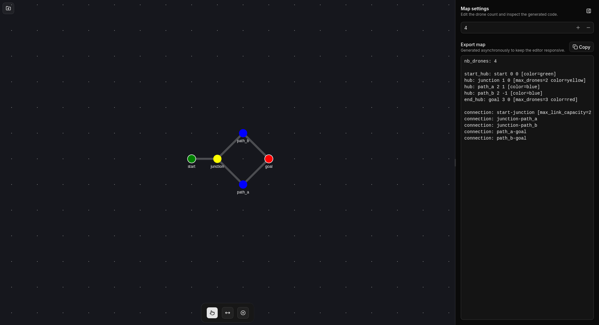
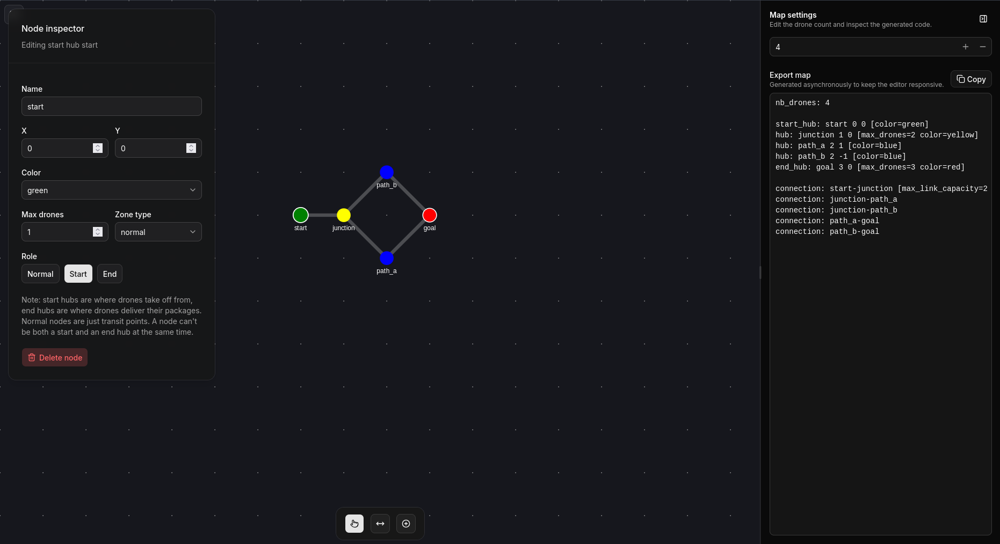
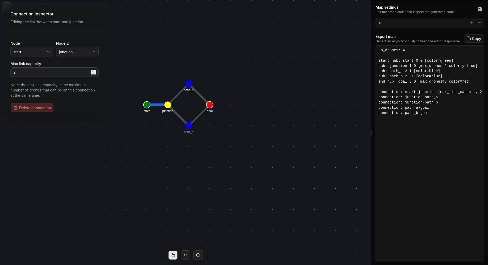
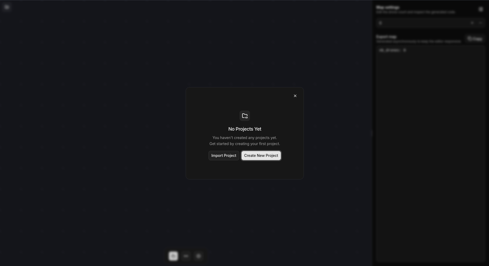

# Flyin-Editor

A powerful visual editor for designing and managing drone network topologies. Create interactive maps with nodes (hubs, waypoints) and connections (routes) for autonomous drone systems with an intuitive canvas-based interface.

## [Live Demo - flyin-editor.cheznestor.fr](https://flyin-editor.cheznestor.fr)

## Features

- **🎨 Visual Canvas Editor** — Interactive canvas with real-time rendering, zoom, pan, and drag capabilities for creating network maps
- **🔗 Node Management** — Create, delete, and customize nodes with properties like position, color, name, capacity, and zone types
- **📡 Connection Management** — Draw connections between nodes, configure link capacities, and visualize network topology
- **🛠️ Multi-Tool System** — Switch between selection, node creation, and connection drawing modes with visual feedback
- **📋 Property Panel** — Real-time editing of selected elements with a collapsible right panel for detailed configuration
- **📂 Import/Export** — Load and save network configurations in a custom format with error validation and reporting
- **⌨️ Keyboard Shortcuts** — Efficient workflow with hotkeys for common operations (delete, undo, tool switching)
- **🎯 Dynamic Right Panel** — Manage network details and element properties in a responsive, collapsible interface

## Screenshots







## Quick Start

### Installation

```bash
# Clone the repository
git clone https://github.com/69Nesta/Fly-In-Map-Editor flyin-editor
cd flyin-editor

# Install dependencies
npm install

# Start development server
npm run dev
```

The editor will open in your browser at `http://localhost:5173`

### Basic Workflow

1. **Create Nodes** — Switch to the Node tool (toolbar) and click on the canvas to create nodes
2. **Configure Nodes** — Select a node and edit its properties in the right panel (name, color, capacity, zone type)
3. **Draw Connections** — Switch to the Connection tool and drag from one node to another to create routes
4. **Edit Properties** — Select connections to configure link capacity and other parameters
5. **Export Map** — Use the project modal to export your network configuration for reuse or sharing

## Architecture

### Project Structure

```
src/
├── components/
│   ├── editor/              # Main canvas and rendering engine
│   │   ├── editor_canvas.tsx    # Konva Stage and canvas controller
│   │   ├── components/          # Node and Connection visual components
│   │   ├── layers/              # Rendering layers (background, connections, nodes)
│   │   ├── overlay/             # UI overlays (toolbar, property editors)
│   │   └── hook/                # Canvas interaction handlers
│   ├── right_panel/         # Property editing interface
│   ├── ui/                  # Reusable UI components (buttons, inputs, dialogs)
│   ├── action_top_left.tsx  # Top-left action buttons
│   └── project_modal.tsx    # Import/export dialog
├── context/                 # Data models and business logic
│   ├── node/                # Node class and zone type definitions
│   ├── connection/          # Connection class and logic
│   ├── metadata/            # Node and connection metadata
│   └── map_loader.ts        # Custom format parser
├── store/                   # Zustand state management
│   ├── editor_store.ts      # UI state (tools, selections, cursor)
│   └── network_store.ts     # Network data (nodes, connections)
├── hooks/                   # Custom React hooks
├── lib/                     # Utility functions
└── enums/                   # Constants and enumerations
```

### Architecture Layers

1. **Canvas Layer** — Konva Stage with interactive rendering of nodes and connections
2. **UI Layer** — React components for toolbars, panels, dialogs, and overlays
3. **State Layer** — Zustand stores managing editor UI state and network data
4. **Data Layer** — Custom classes for nodes, connections, and metadata

### State Management

- **`editor_store.ts`** — Manages UI state: active tool, selected elements, cursor type, modal states
- **`network_store.ts`** — Manages network data: nodes array, connections array, and CRUD operations

## Map Format

The custom map format allows you to define networks in a text-based structure. This format is used for importing and exporting network configurations.


### Metadata Fields

| Field | Type | Description |
|-------|------|-------------|
| `name` | string | Display name of the node |
| `x` | number | X coordinate on canvas |
| `y` | number | Y coordinate on canvas |
| `color` | string | Node color (blue, green, yellow, red, etc.) |
| `capacity` | number | Maximum drones the node can handle |
| `zone_type` | string | Type: hub, waypoint, charging_station, etc. |
| `is_start` | boolean | Marks as a starting point in the network |
| `is_end` | boolean | Marks as a destination point in the network |
| `max_capacity` (connection) | number | Maximum link capacity for the connection |

## Development

### Available Scripts

```bash
# Start development server with hot reload
npm run dev

# Build for production
npm run build

# Preview production build locally
npm run preview

# Run ESLint
npm run lint

# Fix ESLint issues
npm run lint:fix
```

### Technologies Used

| Category | Technology | Version |
|----------|-----------|---------|
| **Framework** | React | 19.2.6 |
| **Language** | TypeScript | 6.0.2 |
| **Canvas** | Konva.js | 10.3.0 |
| **React Wrapper** | React-Konva | 19.2.4 |
| **State Management** | Zustand | 5.0.13 |
| **UI Components** | Shadcn/ui | Latest |
| **Styling** | Tailwind CSS | 4.3.0 |
| **Build Tool** | Vite | 8.0.12 |
| **Icons** | Lucide React | Latest |
| **Validation** | Zod | Latest |
| **Notifications** | Sonner | Latest |

### Setting Up Local Development

1. **Install Node.js** — Ensure you have Node.js 18+ installed
2. **Install dependencies** — `npm install`
3. **Start dev server** — `npm run dev`
4. **Open in browser** — Navigate to `http://localhost:5173`
5. **Enable hot reload** — Changes are automatically reflected in the browser

### Code Structure Guidelines

- **Components** — Functional components with React hooks and custom hooks from `src/hooks/`
- **State** — Use Zustand stores (`editor_store`, `network_store`) for global state
- **Data Models** — Custom classes in `src/context/` for type-safe business logic
- **Canvas Interactions** — Keyboard and mouse handlers in `src/components/editor/hook/`
- **Styling** — Tailwind CSS with responsive design patterns

## cPanel Deployment

This repository includes a GitHub Actions workflow that deploys automatically on pushes to `main`.

Required GitHub Secrets:

- `CPANEL_SSH_HOST` - cPanel server host name or IP
- `CPANEL_SSH_PORT` - SSH port used by the server
- `CPANEL_SSH_USER` - SSH user for deployment
- `CPANEL_SSH_KEY` - private key with access to the deployment account
- `CPANEL_DEPLOY_PATH` - absolute path to the app directory on cPanel

The workflow validates the app with `npm run lint`, `npm run typecheck`, and `npm run build`, then syncs the production bundle into `${CPANEL_DEPLOY_PATH}/build`.

On the server, the Node app should be configured to start from the built app inside the `build` directory. The deploy step also runs `node ace migration:run --force` and touches `tmp/restart.txt` to restart the cPanel Passenger app.

## Keyboard Shortcuts

| Shortcut | Action |
|----------|--------|
| `Delete` / `Backspace` | Delete selected element (node or connection) |
| `Escape` | Deselect current element |
| `1` | Switch to Selection creation tool |
| `2` | Switch to Connection creation tool |
| `3` | Switch to Node tool |

## Contributing

We welcome contributions! To get started:

1. Fork the repository
2. Create a feature branch (`git checkout -b feature/amazing-feature`)
3. Make your changes
4. Run linting (`npm run lint:fix`) to ensure code quality
5. Commit your changes (`git commit -m 'Add amazing feature'`)
6. Push to the branch (`git push origin feature/amazing-feature`)
7. Open a Pull Request

### Code Quality

- Run `npm run lint` before committing
- Follow TypeScript best practices with strict typing
- Keep components focused and reusable
- Add comments for complex logic
- Use descriptive names for variables and functions

## License

This project is licensed under the MIT License. See the [LICENSE](LICENSE) file for details.

## Authors
- [@69Nesta](https://github.com/69Nesta) ([rpetit](https://profile.intra.42.fr/users/rpetit))


## Support

For issues, feature requests, or questions:
- Open an issue on the repository
- Check existing issues for similar problems
- Provide detailed descriptions and reproduction steps

---

**Built with ❤️ for drone network planning and visualization.**
